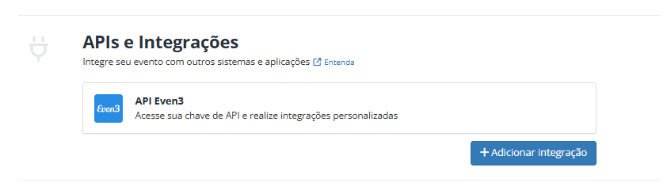

# 🔒 Autenticação

Cada evento possui uma chave de autenticação única.

Para executar requisições válidas à API da Even3 é necessário obter essa chave de acesso (authorization-token) nas configurações do seu evento.

Para obter a chave de acesso é preciso logar no seu evento na plataforma Even3, acessar o menu "[Configurações](https://www.even3.com.br/organizador/configuracao/evento/)" e navegar até a área de "Integrações".&#x20;

<figure><figcaption></figcaption></figure>

<figure><figcaption>
EXEMPLO
</figcaption></figure>

<figure><figcaption>
EXEMPLO
</figcaption></figure>
